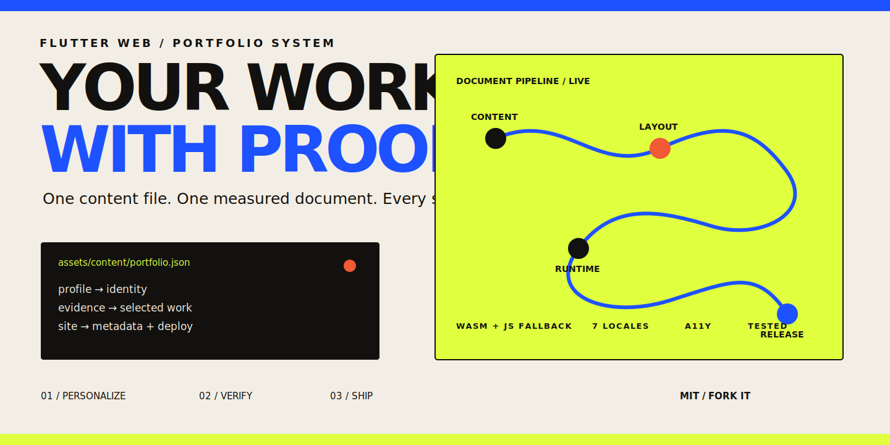

<p align="center">
  
</p>

<p align="center"><strong>A portfolio that behaves like a measured document and ships like a static file.</strong></p>

<p align="center">
  <a href=".github/workflows/ci.yml"></a>
  <a href="https://flutter.dev"></a>
  <a href="LICENSE"></a>
  
</p>

<p align="center">
  <a href="https://github.com/Yusufihsangorgel/Flutter-Web-Portfolio/generate"></a>
</p>

<p align="center">
<!-- portfolio-demo:start -->
[Live site](https://developeryusuf.com/) · [Flutter Web first-frame issue](https://github.com/flutter/flutter/issues/189499) · [Engine patch](https://github.com/flutter/flutter/pull/189500)
<!-- portfolio-demo:end -->
</p>

| One source | One reading model | One release contract |
|---|---|---|
| Identity, biography, work, evidence, links, and metadata live in one validated JSON document. | Real section geometry drives navigation, URL history, progress, responsive reflow, and the visual narrative. | A dual Wasm/JavaScript build is checked for headers, caching, size, accessibility, and browser regressions. |

## From clone to your first frame

Prerequisites: Git, Node.js 24, and Flutter 3.44.6 (Dart 3.12 or newer).
Hosted builds use the pinned Flutter revision in `tool/hosted_build.sh`.

```bash
git clone https://github.com/your-name/your-portfolio.git
cd your-portfolio
npm ci
flutter pub get
npm run portfolio:init
flutter run -d chrome
```

The initializer is a real reset, not a search-and-replace checklist. It asks for
your public identity, role, contact, canonical domain, headline, and focus;
removes the original owner’s optional work, experience, and contribution data;
deletes the demo work artifacts and their source captures; then regenerates the
social card, source manifest, README record, SEO, JSON-LD, web manifest,
sitemap, robots file, analytics include, and server policy.

```text
you answer once
      │
      ▼
assets/content/portfolio.json
      ├──► Flutter document
      ├──► search + social metadata
      ├──► README engineering record
      ├──► manifest + sitemap + robots
      └──► hosting policy + social card
```

[Customization guide](docs/CUSTOMIZE.md) · [Content contract](#the-content-contract) · [Deployment guide](docs/DEPLOY.md)

## Deploy it where you already live

The app is static and has no backend lock-in.

| Host | Shortest path |
|---|---|
| GitHub Pages | push `main`; the included workflow builds with the repository-aware base path |
| Firebase Hosting | `npm run deploy -- firebase --project <id>` |
| Netlify | connect the repo or run `npm run deploy -- netlify` |
| Cloudflare Pages | `npm run deploy -- cloudflare --project <name>` |
| Vercel | import the repo or run `npm run deploy -- vercel` |
| Docker / VPS | `npm run deploy -- docker --image portfolio:latest` |

Each included configuration preserves SPA navigation and the cross-origin
isolation headers used by threaded SkWasm. Custom domains require no Dart
change: edit `site.url`, run `npm run sync:content`, then point DNS at the host.

[Provider-by-provider instructions](docs/DEPLOY.md)

## Why this is not another portfolio grid

Most portfolio templates start with cards and later bolt on data. This one
starts with a document contract:

- Optional chapters genuinely disappear; there are no empty demo sections.
- Work artifacts must be local, accessible, dimensioned, and backed by linked evidence.
- Professional claims remain outside presentation code and translation files.
- The same measured position controls active navigation, browser history,
  scene interpolation, and every progress indicator.
- Reduced motion preserves the entire information architecture instead of
  serving a diminished page.
- Decorative painting listens to frame-adjacent state without rebuilding the
  semantic document or idling at 60 frames per second.
- The critical HTML shell gives slow Wasm visits meaningful content before
  Flutter reaches the compositor.

## The content contract

`assets/content/portfolio.json` is parsed into immutable final classes before
`runApp`. The parser rejects schema drift, duplicate IDs, invalid URLs, reused
artifacts, incomplete featured cases, malformed colors, and identity/metadata
disagreement.

```json
{
  "schema_version": 8,
  "site": { "url": "https://example.com" },
  "profile": { "name": "Your Name", "role": "Software Engineer" },
  "experience": [],
  "contributions": [],
  "systems": []
}
```

That excerpt is intentionally incomplete; use the initializer to produce a
valid clean document, then follow [the field guide](docs/CUSTOMIZE.md) to add
source-backed experience and selected work.

Translations in `assets/i18n/*.json` own interface language only. Seven locale
documents share a tested key schema, including an RTL surface; none duplicates
professional content.

## The runtime, drawn as one path

```text
assets/content/portfolio.json
        │ strict parse before runApp
        ▼
PortfolioDocument ───────────────┐
                                │
assets/presentation/narrative.json
        │ chapter order + motif  │
        ▼                        │
NarrativeDocument               │
        │                        │
assets/i18n/{locale}.json        │
        │ ordered async loading  │
        ▼                        ▼
LanguageCubit              semantic sections
                                │ measured bounds
                                ▼
AppScrollController ─────► NarrativePosition
        │                       │
        │ browser history       ├────► SceneDirector
        │ + visible progress    │           │
        ▼                       ▼           ▼
chapter navigation      chapter anchors    ambient painter
                                │
                                ▼
                       NarrativeAnchorPath
```

The document and render loop deliberately have different update paths. Content
loads once. Frame-frequency scene and pointer changes stay in synchronous
listenables. Responsive reflow preserves chapter-relative focus instead of a
stale pixel offset, and one early popstate bridge keeps browser history from
being consumed twice by Flutter navigation.

## First frame is a measured event

The release does not treat Flutter’s first-frame signal as proof that pixels
have reached the browser compositor. Its generated HTML shell remains aligned
for two browser frames, then leaves exactly once. Ordered User Timing marks
separate entrypoint transfer, engine initialization, Flutter rendering,
compositor-safe reveal, and shell removal.

```bash
# Serve build/web, then sample cold starts and a real full-document scroll.
npm run measure:runtime

# Enforce the checked-in median budget.
npm run verify:runtime
```

Software-rendered headless sessions still record every metric; only explicitly
hardware-bound thresholds are reported rather than misjudged against
SwiftShader readback latency.

## Quality is executable

```bash
npm run portfolio:validate
npm run test:template
npm run test:clone
npm run verify:content
npm run verify:hosting
npm run audit:sources
dart format --output=none --set-exit-if-changed lib test tool
flutter analyze --fatal-infos
flutter test
npm run build:release
npm run test:visual
npm test
```

The gates cover:

- canonical-content drift and source status;
- every reachable Dart source file;
- immutable renderer assets and same-origin fallbacks;
- Wasm/JavaScript size budgets and Nginx packaging;
- keyboard semantics, reduced motion, locale switching, RTL, deep links, and back/forward history;
- desktop, tablet, and mobile visual baselines;
- cold-start, layout-shift, long-task, and scroll-frame budgets;
- a generated clean portfolio with no inherited identity.

## Repository map

| Change this | To change that |
|---|---|
| `assets/content/portfolio.json` | professional content and public metadata |
| `assets/work/` | real project evidence and compact crops |
| `assets/i18n/` | interface translations |
| `assets/presentation/narrative.json` | chapter motifs and scene order |
| `lib/app/domain/` | strict content and narrative contracts |
| `lib/app/controllers/` | measured scroll, history, scene, and reflow state |
| `lib/app/widgets/narrative_stage.dart` | the continuous document trace |
| `tool/` | initialization, synchronization, release, and verification |
| `tests/e2e/` | browser and visual regression contracts |

## Verified public engineering record

The live demo uses the same template with a real professional record. This block
is regenerated from the canonical content document; it is evidence for the demo,
not starter data inherited by `npm run portfolio:init`.

<details>
<summary><strong>Open the current record</strong></summary>

<!-- portfolio-record:start -->
## Public engineering record

**Yusuf İhsan Görgel — Software Engineer.** I’m a software engineer working across Flutter, Dart, Go, and production infrastructure.

Since 2021, I have built and maintained software for mobile devices, tablets, desktop operating systems, and the web. My work includes ERP and point-of-sale products, logistics workflows, digital publishing, backend services, and the release systems around them.

Source status: `2026.07.16.11`, verified 2026-07-16 against GitHub, LinkedIn, FugaSoft, Dorse, and Medium.

### Accepted upstream changes

| Project | Change | Merged | Evidence |
|---|---|---:|---|
| Dart MCP | Separate server feature registration from legacy initialization | 2026-07-15 | [Pull request](https://github.com/dart-lang/ai/pull/524) |
| FlutterFire | Make Firebase core loading deterministic on WebKit | 2026-07-15 | [Pull request](https://github.com/firebase/flutterfire/pull/18443) |
| Flutter Form Builder | Reset unknown dropdown initial values on first build | 2026-07-14 | [Pull request](https://github.com/flutter-form-builder-ecosystem/flutter_form_builder/pull/1512) |
| Drift | Treat SQLite TRUE and 1 defaults as the same schema | 2026-07-14 | [Pull request](https://github.com/simolus3/drift/pull/3835) |
| Go Fiber Recipes | Add a Fiber and Asynq background-jobs recipe | 2026-07-12 | [Pull request](https://github.com/gofiber/recipes/pull/4997) |

### Selected work

| Project | Responsibility | Evidence |
|---|---|---|
| FugaSoft | I work primarily on the Flutter clients and the production concerns around offline data, native integrations, synchronisation, performance, release, and long-term maintenance. | [Project](https://fugasoft.com/) |
| Dorse | I developed the Flutter application and React web surface across live vehicle state, maps, REST and WebSocket flows, deployment, and QA coordination. | [Project](https://dorseapp.com/) |
| Aydınlık E-Gazete | At Promob TR, I worked on the Flutter client, API-backed issue flow, localisation, and mobile releases. | [Project](https://apps.apple.com/tr/app/ayd%C4%B1nl%C4%B1k-e-gazete/id1560103805) |
| Bilim ve Ütopya | At Promob TR, I worked on Flutter features, API integration, localisation, and release support. | [Project](https://apps.apple.com/tr/app/bilim-ve-%C3%BCtopya-e-dergi/id6478221195) |
| Galvapedia | I built the product with Flutter and a Node.js, Express, and MongoDB service layer. | [Project](https://apps.apple.com/tr/app/galvapedia/id1592744617) |
| Queue Inspector MCP | I designed the command surface, typed validation, queue adapters, and conservative state-changing operations. | [Project](https://github.com/Yusufihsangorgel/queue-inspector-mcp) |
| Multi-tenant Gateway | I designed and implemented the reference from transport and tenant resolution through policy, persistence, and test coverage. | [Project](https://github.com/Yusufihsangorgel/go-multitenant-gateway) |
| Redis Task Queue | I designed the public API, queue semantics, failure handling, and runnable examples. | [Project](https://github.com/Yusufihsangorgel/redis_task_queue) |
| Constellation Particles | I implemented the painter, pointer interaction, spatial partitioning, and package examples without runtime dependencies. | [Project](https://github.com/Yusufihsangorgel/constellation_particles) |
| Flutter Web Portfolio | I built and run the Flutter Web site, its external content pipeline, accessibility layer, browser regression suite, and production release. | [Project](https://developeryusuf.com) |

### Work under review

- **Flutter:** [Wait for web rendering before the first-frame event](https://github.com/flutter/flutter/pull/189500) — Wait for outstanding scene renders and the next browser frame before dispatching the event; the pull request is ready for review with seven Chrome renderer and compiler suites passing.
- **Flutter Packages:** [Ignore unrecognized SVG font-weight values](https://github.com/flutter/packages/pull/12199) — Treat unrecognized font-weight values as unspecified, preserve supported mappings, and cover the parser behaviour with the existing vector-graphics test suite.
- **MCP Kotlin SDK:** [Add SEP-2575 request metadata and discovery types](https://github.com/modelcontextprotocol/kotlin-sdk/pull/893) — Add typed experimental metadata accessors, server discovery types, polymorphic codecs, and malformed-input coverage.
<!-- portfolio-record:end -->

</details>

## Contributing

Focused fixes, measured performance improvements, accessibility work, new host
adapters, and locale corrections are welcome. Start with
[CONTRIBUTING.md](CONTRIBUTING.md); the pull-request template names the same
checks CI enforces.

## License

MIT. Keep the license, replace the content, and make the document yours.
