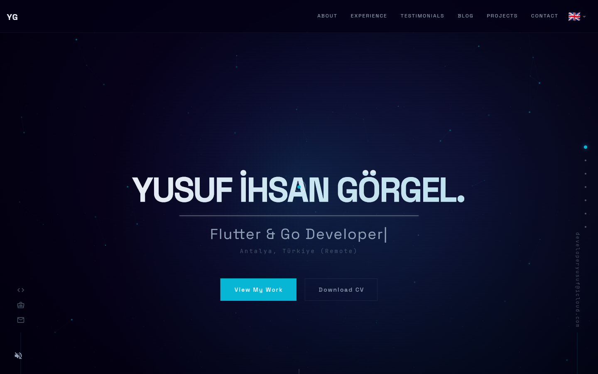
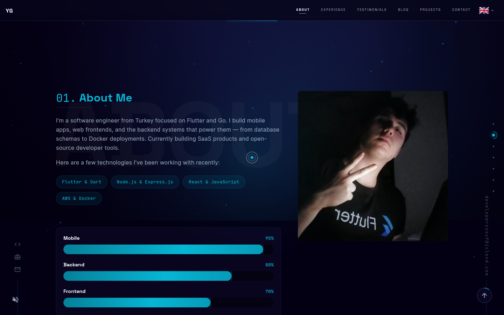
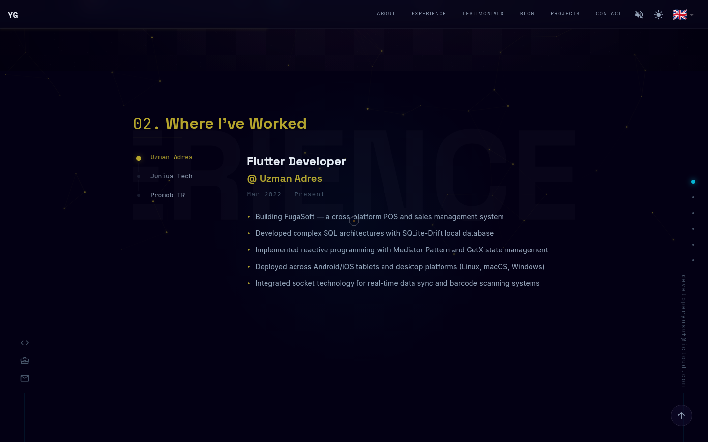
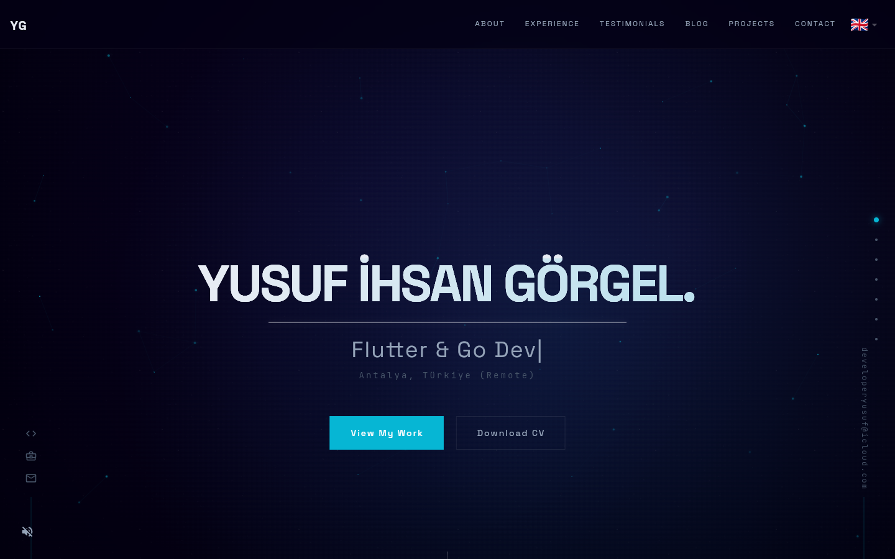
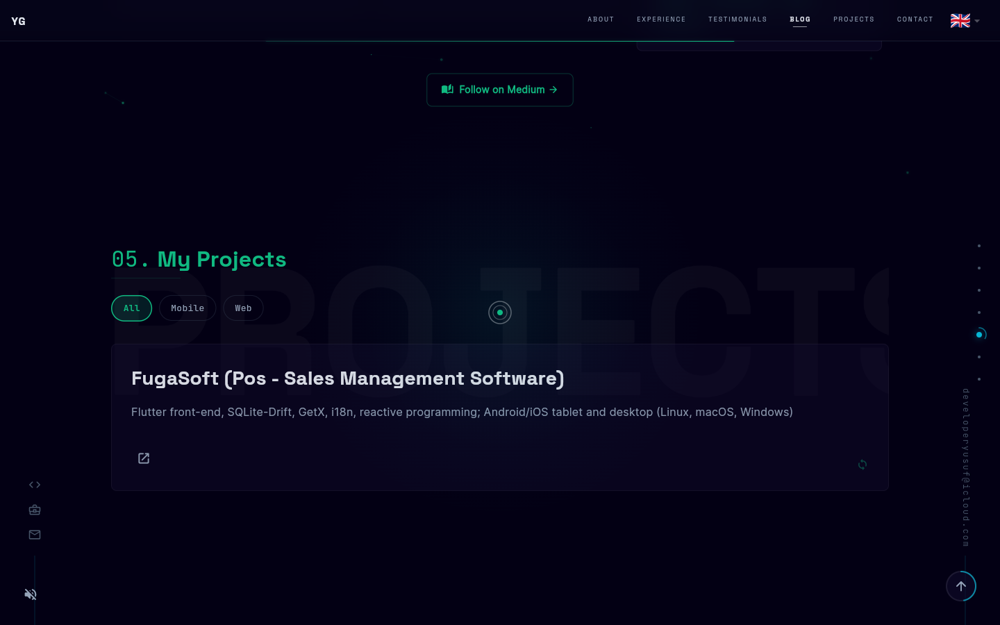
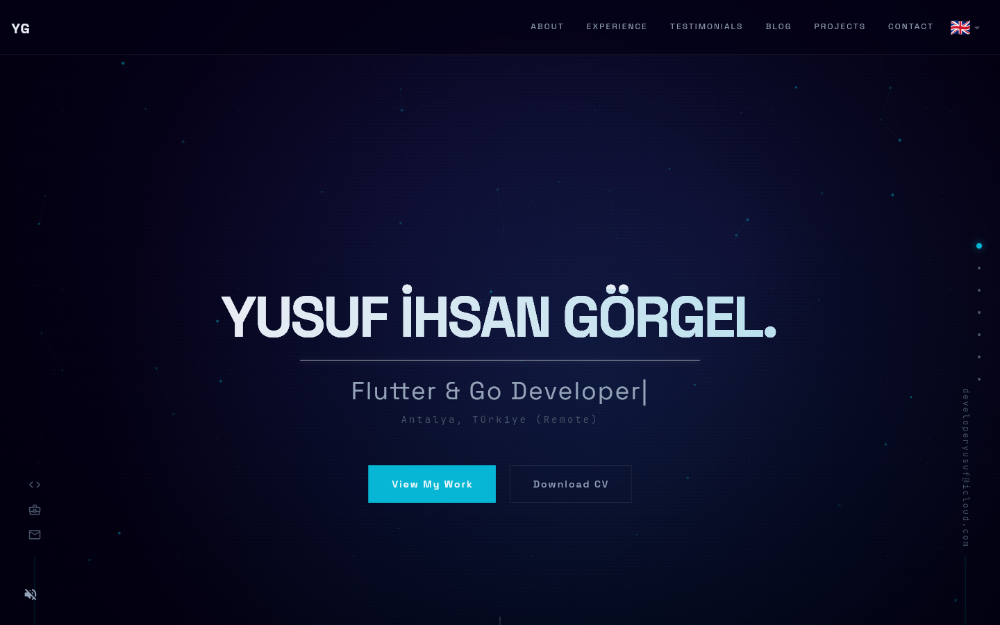
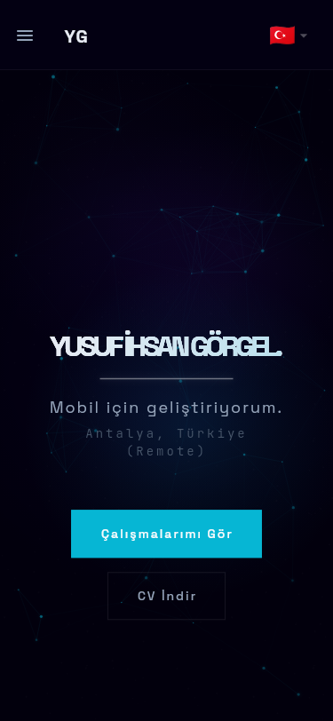

<div align="center">

# Flutter Portfolio — Cinematic Developer Showcase

**A production-grade, cinematic portfolio built entirely with Flutter Web.**\
Scene-driven backgrounds. Scroll-reactive gradients. 185 automated tests. Zero templates.

[](https://github.com/Yusufihsangorgel/Flutter-Web-Portfolio/actions)


[**Live Demo**](https://developeryusuf.com) · [Report Bug](https://github.com/Yusufihsangorgel/Flutter-Web-Portfolio/issues) · [Request Feature](https://github.com/Yusufihsangorgel/Flutter-Web-Portfolio/issues)

</div>

---

## Screenshots



<details>
<summary>View More Screenshots</summary>

| Section | Screenshot |
|---------|------------|
| About |  |
| Experience |  |
| Projects |  |
| Blog |  |
| Contact |  |
| Mobile |  |

</details>

---

## Why This Exists

Most developer portfolios fall into two buckets: boring templates or overengineered React sites. This is neither. It is a **full Flutter application** with proper architecture, real tests, and visual craft that would hold up in a design review.

The cinematic design system draws color palettes from films — Blade Runner 2049, Dune, The Matrix, Spider-Verse, and Interstellar — and crossfades between them as you scroll. Every interaction has been considered: the custom cursor, the hover states, the particle systems, the scroll-reveal timings.

It is also **fully forkable**. Change three files and you have your own portfolio.

---

## Features

### Visual System
- **Scene-driven cinematic backgrounds** — 5 movie-inspired color palettes (Blade Runner 2049, Dune, The Matrix, Spider-Verse, Interstellar) that shift as you scroll
- **Scroll-driven gradient morphing** — crossfade transitions with 200px blend zones between scenes
- **Animated mesh gradient** — organic Lissajous-curve blob movement with mouse parallax
- **Film grain overlay** — procedurally generated grain texture tiled at 60fps for cinematic feel
- **Constellation particles** — interactive particle field with spatial-grid neighbor lookups and connecting lines
- **Vignette overlay** — per-scene intensity control for cinematic framing
- **Custom cursor** — outer ring + inner dot + spotlight glow, with hover expansion on interactive elements
- **Cursor trail effect** — 8-point fading particle trail following the custom cursor

### Content Sections
- **Cinematic Hero** — typewriter text, staggered entrance animations, and scroll-locked intro sequence
- **Typewriter cycling** — hero subtitle types, erases, and retypes multiple role descriptions in a loop
- **About** — terminal emulator with 10+ working commands (help, about, skills, experience, contact, download-cv, etc.)
- **Experience** — timeline with technology tags and expandable descriptions
- **Testimonials** — carousel with colleague and mentor quotes
- **Blog** — Medium RSS integration via rss2json API with live post cards
- **Projects** — case study cards with problem/solution/result breakdowns and multi-link support (web, App Store, Google Play)
- **Project category filtering** — filter projects by category (All/Mobile/Web/Backend) with animated transitions
- **GitHub contribution heatmap** — 90-day activity grid rendered via CustomPainter with 4 intensity levels
- **Contact** — Formspree-ready form with validation and direct email/social links
- **Footer** — source link and command palette hint

### Interactions
- **Command palette** (Ctrl+K / Cmd+K) — fuzzy search across navigation, language switching, and external links
- **Easter Egg** — try the Konami code (up up down down left right left right B A) for a Matrix digital rain overlay
- **3D skill orbit** — concentric elliptical orbits with depth-based scaling (z-axis simulation), category tooltips on hover
- **Scroll-reveal animations** — fade-in with optional scale, configurable delay staggering
- **Magnetic buttons** — cursor-proximity displacement with spring physics
- **Text scramble** — character randomization reveal effect for headings
- **Shader text reveal** — gradient wipe animation for section titles
- **Scroll progress dots** — fixed right-side indicator showing current section
- **Section progress arc** — circular arc around active scroll dot showing section visibility progress
- **Social sidebars** — fixed left/right sidebars with icon links and vertical line (desktop only)
- **Back-to-top button** — appears on scroll with smooth animated return
- **Skip-to-content link** — accessible keyboard navigation, visible on Tab focus

### Architecture & Engineering
- **Clean Architecture** — domain/data/presentation layers with Dependency Inversion (abstract interfaces)
- **Modern Dart 3.x** — `abstract interface class`, `final class`, `base class`, switch expressions, pattern matching
- **GetX state management** — reactive controllers for scroll, scene, language, cursor, sound, and loading states
- **31 custom widgets** — zero external UI dependencies beyond `google_fonts`
- **185 automated tests** — unit tests for all controllers, constants, and models + widget tests for interactive components
- **GitHub Actions CI/CD** — analyze, test, build, and auto-deploy to GitHub Pages on every push

### Internationalization
- **7 languages** — English, Turkish, German, French, Spanish, Arabic (RTL), Hindi
- **Runtime switching** — change language instantly via command palette or dropdown
- **Fully data-driven** — all content (CV, sections, terminal commands) lives in JSON files

### Performance & Progressive Web App
- **PWA manifest** — installable on mobile and desktop
- **WASM build support** — CI pipeline includes experimental WebAssembly build
- **Deep linking** — hash-based URL routing with section auto-scroll
- **Responsive breakpoints** — optimized layouts for mobile (<600px), tablet (600-1200px), and desktop (1200px+)
- **App lifecycle awareness** — animations pause when browser tab is hidden

---

## Quick Start

**Requirements:** Flutter SDK 3.41+ / Dart SDK 3.7+

```bash
# 1. Fork & clone
git clone https://github.com/YOUR_USERNAME/Flutter-Web-Portfolio.git
cd Flutter-Web-Portfolio

# 2. Install dependencies
flutter pub get

# 3. Run locally
flutter run -d chrome

# 4. Build for production
flutter build web --release
```

---

## Make It Yours

You need to change **three files** to make this your own portfolio. That's it.

### 1. Your CV Data — `assets/i18n/en.json`

This single file drives every section of the portfolio. Edit it and the site updates automatically.

```jsonc
{
  "cv_data": {
    "personal_info": {
      "name": "Your Name",                    // Hero section heading
      "title": "Your Job Title",              // Hero subtitle
      "email": "you@example.com",             // Contact section + terminal
      "location": "City, Country",            // Contact section
      "github": "https://github.com/you",     // Sidebar + command palette
      "linkedin": "https://linkedin.com/in/you",
      "bio": "Your bio paragraph...",         // About section
      "medium": "yourMediumUsername"           // Blog section (RSS feed)
    },
    "experiences": [
      {
        "company": "Company Name",
        "position": "Your Role",
        "period": "Jan 2024 – Present",
        "description": "What you did...",
        "technologies": ["Flutter", "Dart"]   // Technology tags
      }
    ],
    "projects": [
      {
        "title": "Project Name",
        "description": "Tech stack summary",
        "url": "https://project.com",         // Single URL or object with multiple links
        "image": "assets/images/project.png",
        "case_study": {
          "problem": "The challenge...",
          "solution": "Your approach...",
          "result": "The outcome..."
        }
      }
    ],
    "skills": [
      { "category": "Mobile", "items": ["Flutter", "Dart", "Swift"] },
      { "category": "Backend", "items": ["Node.js", "Go", "PostgreSQL"] }
    ],
    "testimonials": [
      {
        "quote": "What they said about you...",
        "name": "Colleague Name",
        "position": "Their Title",
        "company": "Their Company"
      }
    ]
  }
}
```

> Repeat for each language file (`tr.json`, `de.json`, `fr.json`, `es.json`, `ar.json`, `hi.json`).

### 2. Your Photo — `assets/images/me.jpeg`

Replace with your own photo. Recommended: 600x600px, JPEG or PNG.

### 3. Your Meta Tags — `web/index.html`

Update these lines for SEO and social sharing:

```html
<!-- Line 14 -->
<title>Your Name - Developer Portfolio</title>

<!-- Line 15 -->
<meta name="description" content="Your description here.">

<!-- Line 17 -->
<meta name="author" content="Your Name">

<!-- Line 18 -->
<link rel="canonical" href="https://yourdomain.com/">

<!-- Lines 22-26: Open Graph -->
<meta property="og:title" content="Your Name - Developer">
<meta property="og:description" content="Your portfolio description.">
<meta property="og:url" content="https://yourdomain.com/">
<meta property="og:image" content="https://yourdomain.com/preview.png">
```

### 4. Your Integrations

| Integration | Where to Change | What to Change |
|------------|----------------|----------------|
| **Medium blog** | `assets/i18n/en.json` → `cv_data.personal_info.medium` | Your Medium username (without @) |
| **GitHub stats** | `lib/app/data/providers/github_provider.dart` → `_username` | Your GitHub username |
| **Contact form** | `lib/app/modules/home/sections/contact/contact_section.dart` | Your Formspree endpoint |
| **CV download** | `lib/app/widgets/command_palette.dart` → `cvUrl` | URL to your hosted PDF |

---

## Deploy

### GitHub Pages (Recommended — Free)

The deploy workflow runs on every push to `main`:

1. Go to **Settings > Pages** in your GitHub repo
2. Set source to **GitHub Actions**
3. Push to `main` — the site deploys automatically

The workflow is in `.github/workflows/deploy.yml`.

### Docker / Self-Hosted

```bash
flutter build web --release
# Upload the build/web/ directory as your site root
```

---

## Architecture

```
lib/app/
├── bindings/              # GetX dependency injection setup
├── controllers/           # Reactive state controllers
│   ├── cursor_controller  #   Custom cursor hover state
│   ├── language_controller#   i18n language switching
│   ├── loading_controller #   App initialization sequence
│   ├── scene_director     #   Scroll-driven scene state machine
│   ├── scroll_controller  #   Section navigation + deep linking
│   └── sound_controller   #   Web Audio API sound design
├── core/
│   ├── constants/         # AppColors, Breakpoints, Durations, SceneConfigs, CinematicCurves
│   └── theme/             # AppTheme (Material 3), AppTypography (Google Fonts)
├── data/
│   ├── models/            # ProjectModel (JSON serialization)
│   ├── providers/         # GitHub API, Medium RSS, Assets, LocalStorage
│   └── repositories/      # LanguageRepositoryImpl, ProjectRepositoryImpl
├── domain/
│   ├── entities/          # Project (domain entity)
│   ├── providers/         # IAssetsProvider, ILocalStorageProvider (interfaces)
│   └── repositories/      # ILanguageRepository, IProjectRepository (interfaces)
├── modules/
│   └── home/
│       ├── bindings/      # HomeBinding (section controller DI)
│       ├── controllers/   # HomeController (page-level state)
│       ├── home_view.dart # 7-layer composited view with parallax
│       └── sections/      # Hero, About, Experience, Testimonials, Blog, Projects, Contact
├── routes/                # GetX routing with deep link support
├── utils/                 # ResponsiveUtils, WebUrlStrategy (path-based URLs)
└── widgets/               # 30+ custom cinematic widgets
    ├── background/        #   CinematicBackground (mesh gradient + grain)
    ├── advanced_cursor    #   Morphing cursor with trail + spotlight
    ├── animated_counter   #   Counting number animation
    ├── animated_stats     #   Animated statistics row
    ├── border_light_card  #   Card with animated border glow
    ├── cinematic_button   #   Scene-aware button with hover effects
    ├── cinematic_focusable#   Keyboard-accessible focus wrapper
    ├── cinematic_preloader#   Full-screen loading sequence
    ├── command_palette    #   Ctrl+K fuzzy search overlay
    ├── constellation_particles # Spatial-grid particle system
    ├── custom_cursor      #   Ring + dot + spotlight cursor
    ├── github_heatmap     #   90-day contribution grid
    ├── magnetic_button    #   Proximity-based displacement
    ├── matrix_rain        #   Konami code easter egg overlay
    ├── neon_effects       #   Neon text, border, card glows
    ├── scroll_fade_in     #   Scroll-triggered reveal animation
    ├── scroll_progress_dots #  Fixed section indicator dots
    ├── shader_text_reveal #   Gradient wipe text animation
    ├── skill_bar_chart    #   Horizontal skill proficiency bars
    ├── skill_orbit        #   3D elliptical orbit visualization
    ├── skeleton_shimmer   #   Loading placeholder shimmer
    ├── text_scramble      #   Character randomization effect
    └── typewriter_text    #   Character-by-character typing
```

### Design Decisions

| Decision | Rationale |
|----------|-----------|
| **GetX over Riverpod/Bloc** | Minimal boilerplate for a single-page app; built-in routing, DI, and reactive state in one package |
| **JSON-driven content** | All CV data lives in translation files — no rebuild needed to update content |
| **Custom painters over packages** | Zero external animation/UI dependencies; full control over performance and visuals |
| **Scene state machine** | Decouples scroll position from visual state; any widget can react to the current scene |
| **Spatial grid for particles** | O(n) neighbor lookups instead of O(n^2) — smooth 60fps even with 100+ particles |
| **Film grain via `toImageSync`** | Pre-rasterized 256x256 texture tiled across viewport; avoids per-frame random draws |

---

## Tech Stack

| Category | Technology |
|----------|-----------|
| Framework | Flutter 3.41 (Web) |
| Language | Dart 3.7 |
| State Management | [GetX](https://pub.dev/packages/get) |
| Internationalization | [flutter_i18n](https://pub.dev/packages/flutter_i18n) (7 languages) |
| Typography | [Google Fonts](https://pub.dev/packages/google_fonts) (Inter, JetBrains Mono, Space Grotesk) |
| HTTP | [http](https://pub.dev/packages/http) (GitHub API, Medium RSS) |
| Storage | [shared_preferences](https://pub.dev/packages/shared_preferences) (language + sound preferences) |
| URL Handling | [url_launcher](https://pub.dev/packages/url_launcher) |
| CI/CD | GitHub Actions (analyze + test + build + deploy) |
| Hosting | GitHub Pages (auto-deploy on push) |
| Testing | flutter_test (185 tests — unit + widget) |

---

## Testing

```bash
# Run all 185 tests
flutter test

# Run with coverage
flutter test --coverage

# Run specific test file
flutter test test/unit/controllers/scene_director_test.dart

# Static analysis (zero warnings required)
flutter analyze --fatal-infos
```

**Test coverage includes:**
- All 6 controllers (scroll, scene director, language, cursor, sound, loading)
- All constant classes (colors, dimensions, breakpoints, durations, curves, scene configs)
- Data models and providers (ProjectModel, GitHubProvider)
- Responsive utilities
- 14 widget tests (command palette, magnetic button, scroll indicators, text effects, and more)

---

## Adding a New Language

1. Create `assets/i18n/ja.json` (copy from `en.json` and translate)
2. Add the locale in `lib/app/data/repositories/language_repository_impl.dart`:
   ```dart
   'ja': 'Japanese',
   ```
3. The language appears automatically in the command palette and language switcher

---

## Contributing

Contributions are welcome. See [CONTRIBUTING.md](CONTRIBUTING.md) for guidelines.

---

## License

MIT License — see [LICENSE](LICENSE) for details.

Built by [Yusuf Ihsan Gorgel](https://github.com/Yusufihsangorgel).
