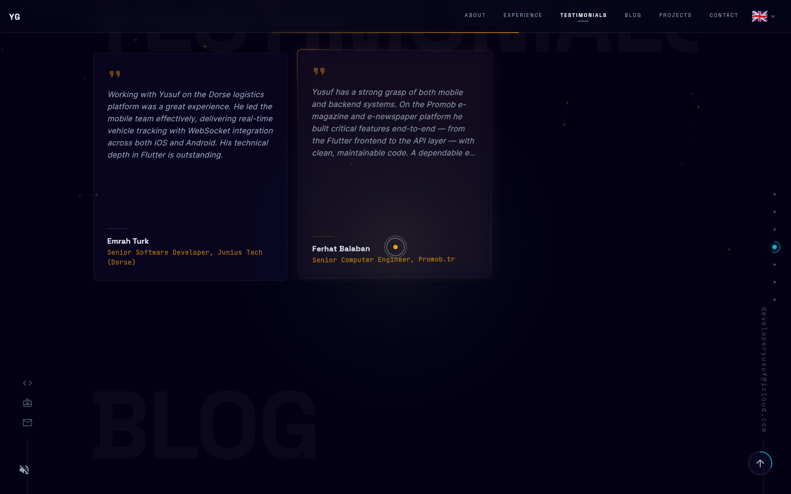

<div align="center">

# Flutter Portfolio — Cinematic Developer Showcase

A developer portfolio built entirely with Flutter Web — cinematic backgrounds, interactive particles, and zero templates.

[](https://github.com/Yusufihsangorgel/Flutter-Web-Portfolio/actions)


[**Live Demo**](https://developeryusuf.com) · [Report Bug](https://github.com/Yusufihsangorgel/Flutter-Web-Portfolio/issues) · [Request Feature](https://github.com/Yusufihsangorgel/Flutter-Web-Portfolio/issues)

</div>

---

https://github.com/Yusufihsangorgel/Flutter-Web-Portfolio/raw/main/screenshots/demo.mp4

---

## Features

🎬 **Cinematic Backgrounds** — 5 movie-inspired palettes that crossfade as you scroll

✨ **Particle System** — spatial grid with O(n) neighbor lookups, cursor repulsion, connecting lines

🎥 **Film Grain** — procedural texture tiled at 60fps via `toImageSync`

⌨️ **Command Palette** — Ctrl+K fuzzy search across navigation, languages, and actions

🌍 **7 Languages** — English, Turkish, German, French, Spanish, Arabic (RTL), Hindi

🎯 **Scroll Animations** — fade-in reveals, magnetic buttons, text scramble, shader wipes

🔊 **Sound Design** — Web Audio API synthesized hover, click, and ambient sounds

🎮 **Easter Egg** — Konami code triggers Matrix digital rain

📱 **Responsive** — mobile, tablet, and desktop breakpoints

🧩 **Forkable** — change 3 files and it's yours

---

## Screenshots


<details>
<summary>More screenshots</summary>

| | |
|---|---|
|  |  |
|  |  |
|  |  |


</details>

---

## Quick Start

```bash
git clone https://github.com/YOUR_USERNAME/Flutter-Web-Portfolio.git
cd Flutter-Web-Portfolio
flutter pub get
flutter run -d chrome
```

## Make It Yours

| What | File | Details |
|------|------|---------|
| Your content | `assets/i18n/en.json` | Name, bio, projects, skills, testimonials — all data-driven |
| Your photo | `assets/images/me.jpeg` | 600x600px recommended |
| Your meta tags | `web/index.html` | Title, OG tags, analytics, structured data |
| Your CV | `assets/data/cv.pdf` | Served by the "Download CV" button |

---

## Architecture

```
lib/app/
├── bindings/           # Dependency injection
├── controllers/        # Scroll, scene, language, cursor, sound, loading
├── core/
│   ├── constants/      # Colors, breakpoints, durations, scene configs
│   └── theme/          # Material 3 theme, typography
├── data/               # Models, providers (GitHub API, Medium RSS), repositories
├── domain/             # Entities and abstract interfaces (DIP)
├── modules/home/
│   ├── home_view.dart  # 7-layer composited view with parallax
│   └── sections/       # Hero, About, Experience, Testimonials, Blog, Projects, Contact
├── routes/             # Deep linking with hash-based URLs
└── widgets/            # 38 custom widgets — particles, cursors, effects, cards
```

**Patterns:** Clean Architecture, `abstract interface class`, `final class`, switch expressions, `case when` guards, GetX reactive state, `ValueNotifier` for granular rebuilds.

---

## Tech Stack

| | |
|---|---|
| **Framework** | Flutter 3.41 (Web) · Dart 3.7 |
| **State** | [GetX](https://pub.dev/packages/get) — routing, DI, reactive controllers |
| **i18n** | [flutter_i18n](https://pub.dev/packages/flutter_i18n) — 7 languages, runtime switching |
| **Fonts** | [Google Fonts](https://pub.dev/packages/google_fonts) — Inter, JetBrains Mono, Space Grotesk |
| **CI/CD** | GitHub Actions — analyze, test, build, deploy to Pages |
| **Zero UI deps** | All 38 widgets are custom — no external animation or component packages |

---

## Deploy

**GitHub Pages** — set source to GitHub Actions in repo settings. Auto-deploys on push.

**Docker** — `flutter build web --release && docker build -t portfolio .`

---

## Contributing

See [CONTRIBUTING.md](CONTRIBUTING.md).

## License

MIT — see [LICENSE](LICENSE).

Built by [Yusuf Ihsan Gorgel](https://github.com/Yusufihsangorgel).
