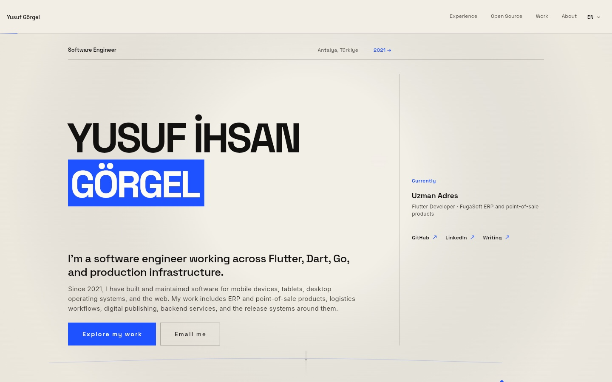
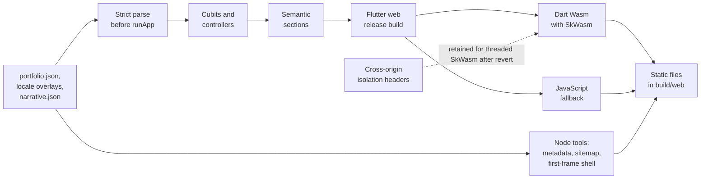

# Yusuf İhsan Görgel — Flutter Web Portfolio

This repository is the source of my portfolio at [developeryusuf.com](https://developeryusuf.com/): a Flutter Web app that builds to static files, with the tooling to reuse it as a template.

<!-- portfolio-demo:start -->
<a href="https://developeryusuf.com/">Live site</a> · <a href="https://github.com/flutter/flutter/issues/189499">Flutter Web first-frame issue</a> · <a href="https://github.com/flutter/flutter/pull/189500">Engine patch</a>
<!-- portfolio-demo:end -->

<!-- portfolio-ci:start -->
  <a href="https://github.com/Yusufihsangorgel/Flutter-Web-Portfolio/actions/workflows/ci.yml"></a>
<!-- portfolio-ci:end -->



## Engineering highlights

- **Accepted Flutter engine fix.** On SkWasm, `flutter-first-frame` could fire before the compositor presented any Flutter content, which left a blank window between a page's loading screen and the app. [flutter/flutter#189500](https://github.com/flutter/flutter/pull/189500) makes the engine wait for the first frame's outstanding renders and for the next browser frame before it sends the event ([issue #189499](https://github.com/flutter/flutter/issues/189499)). This site's loading shell is removed after that event, and `npm run verify:runtime` measures the handoff. The other accepted upstream changes, in Dart, simdjson, gRPC-Go, and other projects, are listed under [Accepted upstream changes](#accepted-upstream-changes).
- **Strict content contract.** `assets/content/portfolio.json` is the single source for the page. Node tools generate the HTML metadata, structured data, manifest, sitemap, and the record below from it. The Dart parser runs before `runApp` and rejects unsupported schema versions, missing fields, duplicate identifiers, and invalid links. A translation is a complete overlay: a locale with a missing field is refused instead of mixing languages ([ADR 0005](docs/adr/0005-strict-json-content-contract.md)).
- **Wasm with a JavaScript fallback.** The release ships the Dart Wasm build (single-threaded SkWasm while flutter/flutter#190039 is open) and a JavaScript fallback, and serves the renderer files from the same origin. Cross-origin isolation headers are retained but not required for the single-threaded path; they will enable threaded SkWasm again after the revert ([ADR 0003](docs/adr/0003-dual-wasm-javascript-runtime.md)).
- **Accessibility and reduced motion.** Playwright tests cover keyboard navigation, reduced motion, language switching across seven languages including right-to-left Arabic, deep links, and browser history. With reduced motion the page stops adaptive effects and still exposes its full heading and control structure.
- **Release checks in CI.** Each pull request runs content synchronization, formatting, static analysis, Flutter tests, the release build, bundle and hosting verification, a clean-template initialization, the browser suite, and runtime budgets. See [Quality gates](#quality-gates).

## Architecture

One content document drives the page. The Flutter app loads it through data adapters, parses it into a strict domain model before `runApp`, and renders semantic sections from Cubit and controller state. Node tools generate the metadata, sitemap, first-frame shell, static semantic document, and résumé from the same document. The release is a set of static files with a Wasm build and a JavaScript fallback.

The current contract is schema 11. This fragment shows the package and writing fields added in that version; it is not a complete document:

```json
{
  "schema_version": 11,
  "packages": [{ "featured": true, "maturity_level": 3, "category": "server" }],
  "writing": [{ "featured": false }]
}
```

`maturity_level` is an integer from 1 to 5. At most five packages and three writing entries may be featured. See [the content guide](docs/CUSTOMIZE.md#the-content-contract) for the remaining required fields.


```mermaid
flowchart LR
  content["portfolio.json,<br/>locale overlays,<br/>narrative.json"] --> parse["Strict parse<br/>before runApp"]
  parse --> state["Cubits and<br/>controllers"]
  state --> sections["Semantic<br/>sections"]
  sections --> build["Flutter web<br/>release build"]
  build --> wasm["Dart Wasm<br/>with SkWasm"]
  build --> js["JavaScript<br/>fallback"]
  wasm --> files["Static files<br/>in build/web"]
  js --> files
  content --> tools["Node tools:<br/>metadata, sitemap,<br/>first-frame shell"]
  tools --> files
  headers["Cross-origin<br/>isolation headers"] -. retained for threaded SkWasm after revert .-> wasm
```

The layer rules are in [docs/ARCHITECTURE-RULES.md](docs/ARCHITECTURE-RULES.md). Design decisions are recorded in [docs/adr](docs/adr/README.md), and known gaps in [docs/TECH-DEBT.md](docs/TECH-DEBT.md).

## Quality gates

CI runs these checks on every pull request and every push to `main`. [`ci.yml`](.github/workflows/ci.yml) is the complete list. The toolchain is Flutter 3.47.5, Dart 3.13.4, and Node.js 24.18.0, pinned in [`tool/quality/toolchain.json`](tool/quality/toolchain.json). Install dependencies first with `flutter pub get`, `npm ci`, and `npm run setup:browsers`.

| Gate | Commands |
|---|---|
| Setup (analyze, test, build) | Checkout, pinned Node/Flutter actions, `node tool/quality/verify_toolchain.mjs --current`, `flutter pub get`; analyze/build also run `npm ci`; build runs `flutter clean` and `npx playwright install --with-deps chromium` |
| Content and generated files | `npm run verify:content`, `npm run portfolio:validate` |
| Tooling tests | `npm run test:template`, `npm run test:starter`, `npm run test:release-security`, `npm run test:release-document`, `npm run test:hosting-security`, `npm run test:refresh`, `npm run test:content`, `npm run test:resume`, `npm run test:audit`, `npm run test:tooling` |
| Typed strings and fonts | `npm run test:strings`, `npm run verify:strings`, `npm run verify:fonts`, `npm run test:fonts` |
| Demo work artifacts (when the renderer exists) | `npm run test:work-artifacts`, `npm run verify:work-artifacts` |
| Hosting, community files, sources, history | `npm run verify:hosting`, `npm run verify:community`, `npm run audit:sources`, `npm run audit:history` |
| Static checks | `npm run typecheck`, `npm run lint`, `npm run format:check`, `npm run verify:source`, `dart format --output=none --set-exit-if-changed lib test tool`, `flutter analyze --fatal-infos` |
| Local package checks | In `packages/adaptive_render_budget`: `flutter pub get`, `dart format --output=none --set-exit-if-changed lib test example/lib`, `flutter analyze --no-pub --fatal-infos`, `flutter test` |
| Dart callable metrics (`Enforce shrink-only Dart metrics`) | `dart run tool/quality/dart_metrics_test.dart`, `dart run tool/quality/dart_metrics.dart --base-ref <base-sha>`; without a base revision, CI checks the current baseline |
| Tool syntax | `bash -n tool/release/hosted_build.sh`, `node --check` on the Node tools |
| Flutter tests and layer coverage | `node tool/quality/test_coverage_gate.mjs`, `flutter test --coverage`, `node tool/quality/coverage_gate.mjs` (domain 99%, application 92%) |
| Release build and bundle | `npm run verify:content`, `npm run prepare:source`, `flutter build web --release --wasm --no-web-resources-cdn`, `npm run resume:build`, `node tool/resume/check_browser_pdf.mjs`, `npm run prepare:bundle`, `npm run verify:bundle` |
| Exact source tree (`Verify the release manifest against the exact git tree`) | `git archive HEAD` extraction and `sha256sum -c --quiet` against the release source manifest |
| Container | `docker build --tag flutter-web-portfolio:ci .` |
| Clean template | `npm run test:clone` |
| Browser tests | `npm test` |
| Runtime budgets | `npm run verify:runtime` |
| Lighthouse (accessibility, best practices, and SEO at 0.95 or higher; performance reported) | `npm run lighthouse` |
| Failure reports | `Upload Playwright results` and `Upload Lighthouse reports` retain reports for 7 days |
| Verified release (`Package verified release`) | Deterministic `tar` + `gzip -n -9`, SHA-256 sidecar, `web-release` artifact upload with 30-day retention |
| Main-only provenance (`attest` job) | `Download verified release`, `sha256sum --check web-release.sha256`, `actions/attest-build-provenance` for `web-release.tar.gz` |
| Architecture layers (path-filtered workflow) | `Architecture gate calibration`: `python3 -m unittest discover -s quality/tests -p 'test_architecture.py'`; `Architecture import rules`: `python3 quality/check_architecture.py` (blocking, empty baseline) |

Pull requests also run code scanning, dependency review, and a Conventional Commits check on the title.

The architecture workflow matches changes under `lib/`, `quality/`, its own workflow, or the architecture rules. CI's release artifact is the production pull-process input; [Pages builds a separate base-path variant](docs/DEPLOY.md#github-pages).

<!-- portfolio-record:start -->
## Public engineering record

**Yusuf İhsan Görgel — Software Engineer.** I’m a software engineer working across Flutter, Dart, Go, and production infrastructure.

Since 2021, I have built and maintained software for mobile devices, tablets, desktop operating systems, and the web. My work includes ERP and point-of-sale products, logistics workflows, digital publishing, backend services, and the release systems around them.

Source status: `2026.09.28.1`, verified 2026-08-29 against GitHub, LinkedIn, FugaSoft, Dorse, and Medium.

### Accepted upstream changes

| Project | Change | Merged | Evidence |
|---|---|---:|---|
| Flutter | Wait for web rendering before the first-frame event | 2026-08-11 | [Pull request](https://github.com/flutter/flutter/pull/189500) |
| MCP Kotlin SDK | Add SEP-2575 request metadata and discovery types | 2026-08-05 | [Pull request](https://github.com/modelcontextprotocol/kotlin-sdk/pull/893) |
| Flutter | Return null from RenderProxyBoxMixin.computeDryBaseline when the child has no baseline | 2026-07-30 | [Pull request](https://github.com/flutter/flutter/pull/189723) |
| Flutter Packages | Ignore unrecognized SVG font-weight values | 2026-07-28 | [Pull request](https://github.com/flutter/packages/pull/12199) |
| simdjson | Treat 20-digit positive overflows as big integers | 2026-07-28 | [Pull request](https://github.com/simdjson/simdjson/pull/2793) |
| Dart Native Assets | Validate dynamic library architecture from file headers | 2026-07-27 | [Pull request](https://github.com/dart-lang/native/pull/3484) |
| Dart MCP | Add the caching hints from the 2026-07-28 protocol revision | 2026-07-27 | [Pull request](https://github.com/dart-lang/ai/pull/570) |
| gRPC-Go | Restore the plan9 build by splitting errno matching out | 2026-07-23 | [Pull request](https://github.com/grpc/grpc-go/pull/9255) |
| Retrofit for Dart | Keep the request future in the stream pipeline for ResponseType.stream | 2026-07-21 | [Pull request](https://github.com/trevorwang/retrofit.dart/pull/921) |
| Retrofit for Dart | Guard PartMap helper variables for nullable file parts | 2026-07-21 | [Pull request](https://github.com/trevorwang/retrofit.dart/pull/920) |
| Retrofit for Dart | Make contentType null-safe in newRequestOptions | 2026-07-21 | [Pull request](https://github.com/trevorwang/retrofit.dart/pull/919) |
| Dart MCP | Operate on decoded messages instead of JSON strings | 2026-07-20 | [Pull request](https://github.com/dart-lang/ai/pull/531) |
| Shelf | Join multiple Cookie header values with the RFC-correct separator | 2026-07-20 | [Pull request](https://github.com/dart-lang/shelf/pull/536) |
| Bun | Surface lost SQL migration finalizer errors | 2026-07-17 | [Pull request](https://github.com/uptrace/bun/pull/1390) |
| Dart MCP | Add request-scoped message dispatch for MCP servers | 2026-07-17 | [Pull request](https://github.com/dart-lang/ai/pull/528) |
| Dart MCP | Separate server feature registration from legacy initialization | 2026-07-15 | [Pull request](https://github.com/dart-lang/ai/pull/524) |
| FlutterFire | Make Firebase core loading deterministic on WebKit | 2026-07-15 | [Pull request](https://github.com/firebase/flutterfire/pull/18443) |
| Flutter Form Builder | Reset unknown dropdown initial values on first build | 2026-07-14 | [Pull request](https://github.com/flutter-form-builder-ecosystem/flutter_form_builder/pull/1512) |
| Drift | Treat SQLite TRUE and 1 defaults as the same schema | 2026-07-14 | [Pull request](https://github.com/simolus3/drift/pull/3835) |
| Go Fiber Recipes | Add a Fiber and Asynq background-jobs recipe | 2026-07-12 | [Pull request](https://github.com/gofiber/recipes/pull/4997) |

### Selected work

| Project | Responsibility | Evidence |
|---|---|---|
| FugaSoft | I work primarily on the Flutter clients and the production concerns around offline data, native integrations, synchronisation, performance, release, and long-term maintenance. | [Project](https://fugasoft.com/) |
| Dorse | I developed the Flutter application and React web surface across live vehicle state, maps, REST and WebSocket flows, deployment, and QA coordination. | [Project](https://dorseapp.com/) |
| Aydınlık E-Gazete | At Promob TR, I worked on the Flutter client, API-backed issue flow, localisation, and mobile releases. | [Project](https://apps.apple.com/tr/app/ayd%C4%B1nl%C4%B1k-e-gazete/id1560103805) |
| Bilim ve Ütopya | At Promob TR, I worked on Flutter features, API integration, localisation, and release support. | [Project](https://apps.apple.com/tr/app/bilim-ve-%C3%BCtopya-e-dergi/id6478221195) |
| Queue Inspector MCP | I designed the command surface, typed validation, queue adapters, and conservative state-changing operations. | [Project](https://github.com/Yusufihsangorgel/queue-inspector-mcp) |
| Multi-tenant Gateway | I designed and implemented the reference from transport and tenant resolution through policy, persistence, and test coverage. | [Project](https://github.com/Yusufihsangorgel/go-multitenant-gateway) |
| Redis Task Queue | I designed the public API, queue semantics, failure handling, and runnable examples. | [Project](https://github.com/Yusufihsangorgel/redis_task_queue) |
| Constellation Particles | I implemented the painter, pointer interaction, spatial partitioning, and package examples without runtime dependencies. | [Project](https://github.com/Yusufihsangorgel/constellation_particles) |
| Flutter Web Portfolio | I built and run the Flutter Web site, its external content pipeline, accessibility layer, browser regression suite, and production release. | [Project](https://developeryusuf.com) |
<!-- portfolio-record:end -->

<!-- portfolio-record-intro:start -->
The live demo uses this template with the author's own record. This block is regenerated from the canonical content document; it is evidence for the demo, not starter data inherited by `npm run portfolio:init`.
<!-- portfolio-record-intro:end -->

## Use it as a template

You can reuse the site for your own portfolio: create a repository from this template, run the initializer, and follow [docs/TEMPLATE.md](docs/TEMPLATE.md) for content, build, and hosting.

<!-- portfolio-template:start -->
  <a href="https://github.com/Yusufihsangorgel/Flutter-Web-Portfolio/generate"></a>
<!-- portfolio-template:end -->

<!-- portfolio-onboarding:start -->
Choose **Use this template** above and create your own repository. Do not fork the demo for a personal site: GitHub forks retain the parent history, whereas a repository created from a template starts with one unrelated commit. Forks remain the right path for contributing changes back here. Clone your new repository, then run:
<!-- portfolio-onboarding:end -->

```bash
npm ci
npm run setup:browsers
flutter pub get
npm run portfolio:init
```

## Contributing

Read [CONTRIBUTING.md](CONTRIBUTING.md) and the [architecture rules](docs/ARCHITECTURE-RULES.md) before you propose a change. Pull request titles use Conventional Commits, and the [pull request template](.github/PULL_REQUEST_TEMPLATE.md) lists the CI checks. To report a security problem, see [SECURITY.md](SECURITY.md).

## License

MIT. See [LICENSE](LICENSE). [NOTICE](NOTICE) lists the screenshots, product names, and fonts that the MIT license does not cover.
